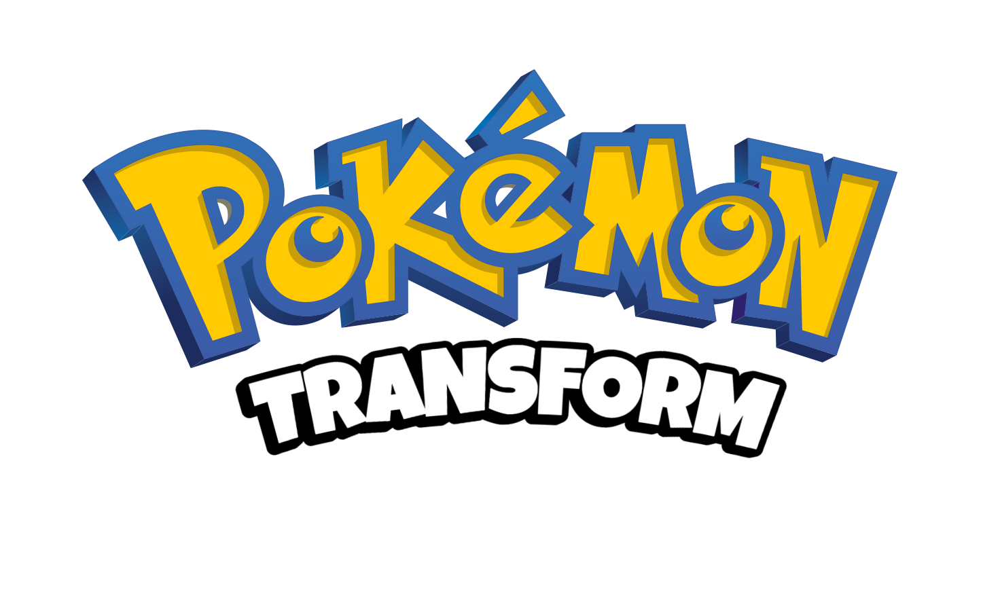
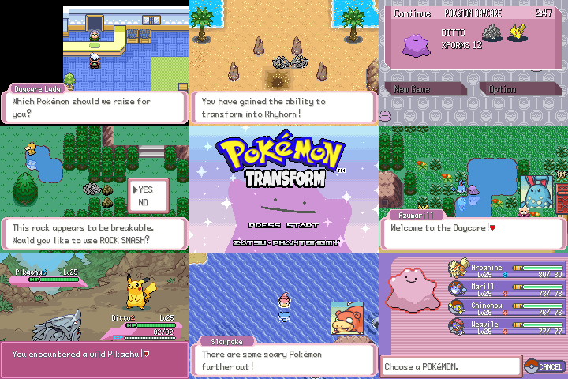

# Pokemon Transform
Transform is a project which follows the story of a Ditto dropped off at the daycare on Route 117 in the Hoenn region, tasked with obtaining an Egg. The thing is... no one, not even the Daycare Man, knows where Eggs come from. Additionally, Pokemon in the daycare seem quite confused about how they are supposed to be gaining EXP. You will to follow the journey of Ditto as it learns the secrets behind where Pokemon Eggs come from and how EXP is gained in the daycare.

## About the game
### Features
- Play as Ditto on an adventure to find its Mythical Egg
- Transform into various Pokemon to use them in battle and use their overworld abilities
- NPCs may treat you differently depending on what you look like
- Modern UIs
- Lucky Eggs act as currency
- Whiteout counter for high scoring (with secret reward)

## Download
### Download the zip file containing the patch file in the [**Releases**](release link) Section.

**the zip file contains**
- A patch file for poketransform, to be applied to Emerald
- A copy of this ReadME file

## Patching your ROM
Use [Rom Patcher JS](https://www.marcrobledo.com/RomPatcher.js/legacy/) to patch the files.
**You will need to provide your own **legally obtained** copy of Emerald.**
- Upload the Emerald.gba file to the "ROM file" section
- Upload the poketransform patch file to the "Patch file" section
- Look for a green checkmark and hit apply patch. 
This will automatically download your new poketransform.gba ROM for you to play!

## Recommended Emulators
- For PC/Mac: mGBA
- For Android: pizzaboy, Lemuroid, Retroarch w/ mGBA core.
- For IOS: Retroarch w/ mGBA core, Ignited.
- For Linux Handheld Devices: Retroarch w/ mGBA core.

## Support
For further assistance, join the [discord](https://discord.gg/5KaesJHx9e )!

## Credits
### Codebase
- Pokemon emerald, gamefreak
- pokeemerald decomp, pret
- pokemerald-expansion, RHH

### Features 
- Easyfade title screen colors, Bivurnium
- main menu UI, Archie and Mudskip
- options plus menu, Archie and Mudskip
- heat start menu, vol
- BW Summary Screen, Rave
- battle Ui, Nico
- key item wheel, merpp
- QoL field moves, psf
- universal voicegroup, aichiya
- field mugshots and nameplates, Mudskip + Tustin
- battle speedup, alex
- FRLG font, PurrfectDoodle

### Tools
- poryscript, shantytown
- porymap, griffinR and others
- triple layer metatiles converter tool, SBird

### Tilesets
- ORAS tiles, leob 
- desert, beach cave, temple tiles, Rahtek

### Music
- PMD music, liberty twins + online google drive of transcribed midis

### Other art
- PMD Mugshots, PMD sprite repo (individual credits linked elsewhere)
- Stars on title screen, pokabbie
- surfing pokemon OW sprites, Wally and others?
- CFRU battle bgs, WesleyFG

### Other acknowledgement 
- Transformation basics, Archie, wiz, Mudskip from the Pit.
- Skip battle trainer intro, Jamie
- Swimming code basis, pokabbie
- Scripting tips, Celia dawn
- Copyright screen, idea borrowed from pokabbie
- The homies in TAH

### Playtesters
Celia dawn
Montblanc

### Devs and contributions
**Phantonomy**
- Scripting
- Mugshots modification and implementation
- UI modification and implementation
- Music modification and implementation
- Transformation: initial implementation and other functionality (surf, waterfall, dive, arcanine speed, Weavile hop) 
- XFORMs modification of PC
- Title Screen
- Writing
- Mapping basis
- General code things
- Gameplay balance

**Zatsu**
- transformation: cleanup, structure, optimization, use from merpps item wheel, control of battle form, control of field moves (rock smash, strength, cut). And more.
- In battle transformations
- New party menu UI
- Battle engine changes
- Mapping cleanup
- Scripting cleanup 
- General code things but better

more things to come i just know my own work better than Zatsu’s will ask for more in depth lists
