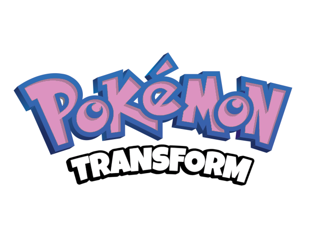

# Pokemon Transform

poketransform is a project which follows the story of a Ditto dropped off at the daycare on Route 117 in the Hoenn region, tasked with obtaining an Egg. The thing is... no one, not even the Daycare Man, knows where Eggs come from. Additionally, Pokemon in the daycare seem quite confused about how they are supposed to be gaining EXP. You will to follow the journey of Ditto as it learns the secrets behind where Pokemon Eggs come from and how EXP is gained in the daycare.

---
### Table of Contents

* [About the game](#about-the-game)
* [How to play](#how-to-play)
* [Support](#support)
* [Credits](#credits)
* [For Developers](#for-developers)
---

## About the game

### Features

* Play as Ditto on an adventure to find its Mythical Egg
* Overworld Transformation System
* In battle Transformation System
* NPCs may treat you differently depending on what you look like
* Modern UIs
* PMD music
* PMD mugshots
* Lucky Eggs act as currency
* Whiteout counter for high scoring (with secret reward)

## How To Play

### Download
You can patch your **legally obtained copy of Emerald** directly on the [poketransform patching site](https://teamaquashideout.github.io/tah-patchsite/hacks/transform/). 

Alternatively, you can download the zip file containing the patch file in the **Releases** section [here](https://github.com/Ddaretrogamer/Transform/releases).

**The zip file contains:**

* A patch file for poketransform, to be applied to Emerald
* A copy of this ReadME file

### Patching your ROM
Use [Rom Patcher JS](https://www.marcrobledo.com/RomPatcher.js/legacy/) to patch the files.
**You will need to provide your own legally obtained copy of Emerald.**

* Upload the Emerald.gba file to the "ROM file" section
* Upload the poketransform patch file to the "Patch file" section
* Look for a green checkmark and hit apply patch.
  
This will automatically download your new poketransform.gba ROM for you to play!

### Recommended Emulators

* For PC/Mac: mGBA
* For Android: pizzaboy, Lemuroid, Retroarch w/ mGBA core.
* For IOS: Retroarch w/ mGBA core, Ignited.
* For Linux Handheld Devices: Retroarch w/ mGBA core.

## Support

For further assistance, join the [discord](https://discord.gg/5KaesJHx9e)!

## Credits

### Hack Developers

* Phantonomy
* Zatsu

### Codebase

* pokeemerald decomp, pret
* pokemerald-expansion, RHH

### Features

* Easyfade title screen colors, Bivurnum
* main menu UI, Archie and Mudskip
* options plus menu, theXaman, Archie and Mudskip
* heat start menu, vol
* BW Summary Screen, RavePossum
* battle Ui, Nico
* key item wheel, merpp
* QoL field moves, psf
* universal voicegroup, aichiya
* field mugshots and nameplates, Mudskip + Tustin
* battle speedup, alexonl1ne
* FRLG font, PurrfectDoodle

### Tools

* poryscript, shantytown
* porymap, griffinR and others
* triple layer metatiles converter tool, SBird

### Tilesets

* ORAS tiles, leob0505
* Desert, Beach Cave, and Temple tilesets, Rahtek

### Music

* PMD music, LibertyTwins + online google drive of transcribed midis

### Other art

* PMD Mugshots, [PMD sprite repo](https://sprites.pmdcollab.org/), [specific credits](pmd_mugshot_credits.txt)
* Stars on title screen, pokabbie
* surfing pokemon OW sprites, Wally217 and slawter666
* CFRU battle bgs, WesleyFG

### Other acknowledgement

* Transformation basics, Archie, Wiz, Mudskip from the Pit.
* Skip battle trainer intro, Jamie
* Swimming code basis, pokabbie
* Scripting tips, Celia Dawn
* Copyright screen, idea borrowed from pokabbie
* The homies in TAH

### Playtesters

* Celia Dawn
* Montblanc

## For Developers
This project is open source, and you can find all of the code in this repo [here](https://github.com/Ddaretrogamer/Sun-and-Moon-Eclipse/tree/TARC2-Transform).
